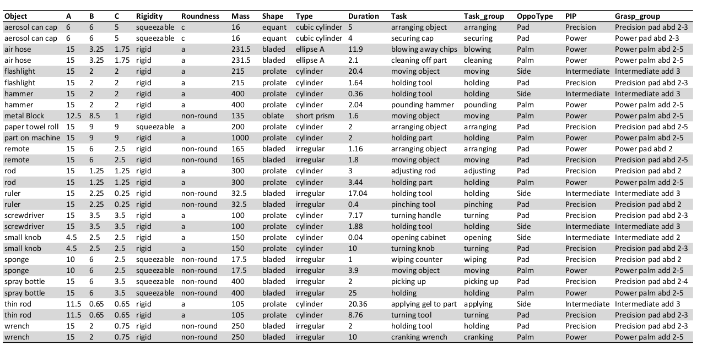

# Context-Aware Task-Oriented Dexterous Grasping Using an Anthropomorphic Robotic Hand

This paper contains a NIR dataset and related pre-processing method. If you find this code useful in your research, please consider citing:

    @inproceedings{li2021learning,
      title={Learning Task-Oriented Dexterous Grasping from Human Knowledge},
      author={Li, Hui and Zhang, Yinlong and Li, Yanan and He, Hongsheng},
      booktitle={2021 IEEE International Conference on Robotics and Automation (ICRA)},
      pages={6192--6198},
      year={2021},
      organization={IEEE}
    }
[[download paper](https://ieeexplore.ieee.org/abstract/document/9562073)]

    @inproceedings{li2020magichand,
      title={MagicHand: Context-Aware Dexterous Grasping Using an Anthropomorphic Robotic Hand},
      author={Li, Hui and Tan, Jindong and He, Hongsheng},
      booktitle={2020 IEEE International Conference on Robotics and Automation (ICRA)},
      pages={9895--9901},
      year={2020},
      organization={IEEE}
    }
[[download paper](https://ieeexplore.ieee.org/document/9196538)]

    @inproceedings{rao2018learning,
      title={Learning robotic grasping strategy based on natural-language object descriptions},
      author={Rao, Achyutha Bharath and Krishnan, Krishna and He, Hongsheng},
      booktitle={2018 IEEE/RSJ International Conference on Intelligent Robots and Systems (IROS)},
      pages={882--887},
      year={2018},
      organization={IEEE}
    }
[[download paper](https://ieeexplore.ieee.org/document/8593886)]

This code was tested on an Ubuntu 16.04 system.

### MagicHand Platform ####
The MagicHand platform integrates an AR10 anthropomorphic robotic hand, a Sawyer robotic arm, a SCiO sensor, and an Intel Realsense D435 depth camera.

### Context-Aware Task-Oriented Dexterous Grasping Workflow ####   

### Datasets ####

#### NIR dataset 
1. Contains 15936 near-infrared spectra of six types of materials including ceramic, stainless steel, wood, cardboard, plastic, and glass materials. 
2. 54 different daily used objects were selected. For each object, 10 sample were selected for data collection. For each sample, about 30 NIR spectra was collected using SciO sensor 

#### Task-Oriented Objects Dataset 
This dataset was revised from the Yale human grasping dataset. It contains human knowledge representation of 6554 grasping tasks and 154 3D object models.

### Context-Aware Task-Oriented Dexterous Grasping Results ####
The traning accuracy on four randomly selected object of different shapes are no less than 99% for each of grasp topology. The testing accuracy on new objects with the same shapes are between 87.6% (pPdAb25) and 92.8% (pPdAb23). The testing videos are shown below.

https://user-images.githubusercontent.com/63925943/180021726-228e09d4-3ae0-4d82-bb48-64397fff7cd0.MP4

https://user-images.githubusercontent.com/63925943/180021749-f68cf79a-7575-492d-b6a6-572cadab0884.MP4

https://user-images.githubusercontent.com/63925943/180021812-d2925eb1-5f62-4a95-9e16-69f104d0e0fa.MP4

https://user-images.githubusercontent.com/63925943/180021837-4b529247-5ee5-44f8-8587-4d2884a5146b.MP4

https://user-images.githubusercontent.com/63925943/180021907-c1225307-9126-42f0-b11e-8a041815397d.MP4

https://user-images.githubusercontent.com/63925943/180021930-caa6b29f-37aa-4876-9d3e-b7eac5f95e1e.MP4

https://user-images.githubusercontent.com/63925943/180021978-bd4753a2-69af-4685-b033-245c533f053b.MP4

https://user-images.githubusercontent.com/63925943/180022037-9ac85103-e4bc-43ea-8bec-2863af2ab21f.MP4

### Application and Usage
Near-infrared spectroscopy (NIRS) is a low-cost, simple, fast and nondestructive technique to analyze the spectrum of materials on a molecular level. NIRS is increasingly becoming one of the most efficient analytical tools in chemistry composition and material recognition.  

Originally, NIRS is mainly used in food industry to differentiate fruits or plants, analyze chemical composition or test food quality. Recently, this technique is also used to detect falsified medicines, classify gasoline, recognize colonic tissues and human-computer interface. 

As a non-destructive, non-invasive, chemical-free and rapid way to identify various materials, NIRS has great potential for aiding robot to interact with environments. 
