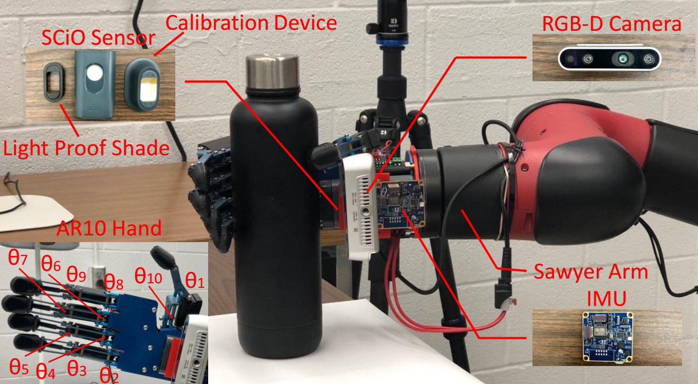
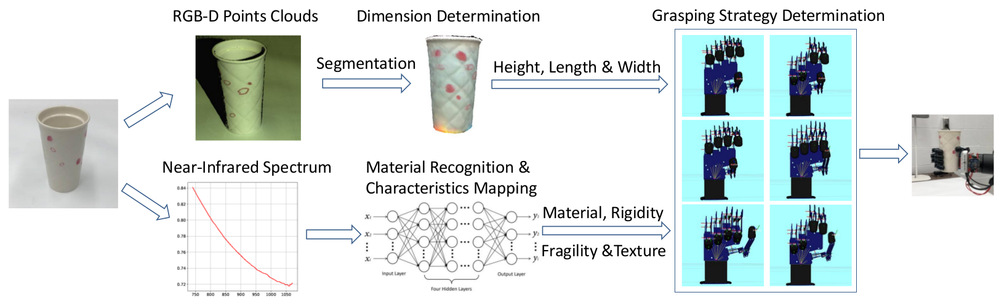
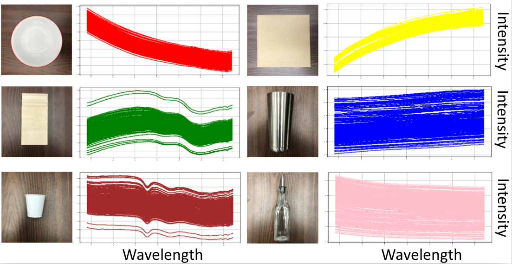

# MagicHand: Context-Aware Dexterous Grasping Using an Anthropomorphic Robotic Hand

This paper contains a NIR dataset and related pre-processing method ([paper](https://ieeexplore.ieee.org/document/9196538)). If you find this code useful in your research, please consider citing:

    @inproceedings{li2020magichand,
      title={MagicHand: Context-Aware Dexterous Grasping Using an Anthropomorphic Robotic Hand},
      author={Li, Hui and Tan, Jindong and He, Hongsheng},
      booktitle={2020 IEEE International Conference on Robotics and Automation (ICRA)},
      pages={9895--9901},
      year={2020},
      organization={IEEE}
    }

This code was tested on an Ubuntu 16.04 system.

### Main Idea
In this paper, we collect NIR spectra and RGB-D data to recognize characsterics of target object, and generate proper grasping strategies based on these characsterics.  

##### MagicHand Platform #####
The MagicHand platform is an objectoriented, context-aware dexterous grasping system.
* AR10 anthropomorphic robotic hand    
* Sawyer robotic arm
* SCiO sensor
    * Gather NIR spectum from target object
* Intel Realsense D435 depth camera 
    * Collect RGBD images
    

##### Work Flow #####
The collected information is processed to get the characsterics of the object
* RGB-D Points Clouds
    * Dimensions of object
* NIR spectrum
    * Material, rigidity, fragility and texture
    

### NIR dataset
1. Contains 15936 near-infrared spectra of six types of materials including
    * ceramic 
    * stainless steel 
    * wood 
    * cardboard 
    * plastic
    * glass 
2. 54 different daily used objects were selected. 
    * Expand the universality of our datasets. 
    * For each object, 10 sample were selected for data collection 
    * For each sample, about 30 nir spectra was collected using SciO sensor 
    * The number of nir spectra collected for each sample dependon the size of the sample. 

3. Python codes for several preprocesing method are also included.

### Application and Usage
Near-infrared spectroscopy (NIRS) is a low-cost, simple, fast and nondestructive technique to analyze the spectrum of materials on a molecular level. NIRS is increasingly becoming one of the most efficient analytical tools in chemistry composition and material recognition.  

Originally, NIRS is mainly used in food industry to differentiate fruits or plants, analyze chemical composition or test food quality. Recently, this technique is also used to detect falsified medicines, classify gasoline, recognize colonic tissues and human-computer interface. 

As a non-destructive, non-invasive, chemical-free and rapid way to identify various materials, NIRS has great potential for aiding robot to interact with environments. 
